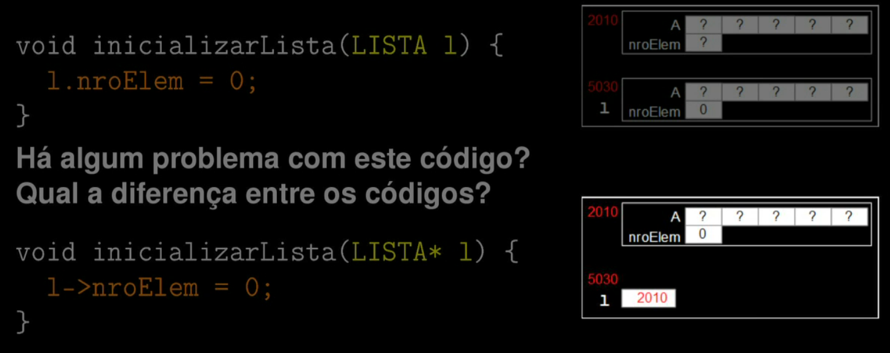

Notas e sequência das aulas de [estrutura de dados](https://www.youtube.com/playlist?list=PLxI8Can9yAHf8k8LrUePyj0y3lLpigGcl)

Funções de gerenciamento (para quase todas as estruturas de dados)

- Inicializar a estrutura
- Retornar a quantidade de elementos válidos
- Exibir os elementos da estrutura
- Buscar por um elemento na estrutura
- Inserir elementos na estrutura
- Excluir elementos na estrutura
- Reinicializar a estrutura

---

## Indice

01 - Apresentação da disciplina

- [file](test.c)

02 - Criação de uma primeira estrutura

- comparação entre Java e C
  - modelar, instanciar, acessar, uso de memoria
- ponteiro e alocação de memoria

- [file](./primeira-estrutura.c)
- [file](./ponteiros.c)
- [file](./alocacao-memoria.c)
- [file](./primeira-estrutura-com-alocacao-memoria.c)

03 - Lista linear sequencial
lista linear: estrutura de dados com cada elemento tendo anterior e sucessor (exceto 1o e ultimo); elementos possuem uma dada sequencia (inclusão, ordenados...)

lista linear sequencial: lista linear cuja ordem logica vista pelo usuário (4, 8, 9,1) é a mesma ordem física, em memória (ou seja, se excluir o 8, não ficará espaço em branco/inválido, os após são movidos para preencher essa lacuna, o mesmo deve ser feito no código)

modelagem:

- usa um arranjo de registros
- registros possuem dados relevantes ao usuário
- arranjo possui tamanho fixo

enquanto a primeira `cria uma cópia de uma lista` a segunda `faz referencia a lista definida` exibindo na img o endereço na memória na qual a lista esta sendo salva

- [file](./lista-linear-sequencial.c)

04 - Lista linear sequencial (continuação)

o que é visto?
- otimização da busca sequencial (busca com elemento sentinela)
- inserir elemento ordenado
- busca binaria

- [file](./lista-linear-continuacao.c)

05 - Lista ligada (implementação estática)

- [file](./lista-ligada.c)

06 - Lista ligada (implementação dinâmica)

Dinamico aqui significa qu pPara cada elemento que vai ser criado é alocado um espaço na memoria para armazena-lo (diferente de antes, onde o limite era estático) e quando se exclui a memoria é liberada.

- [file](./lista-ligada-dinamica.c)
