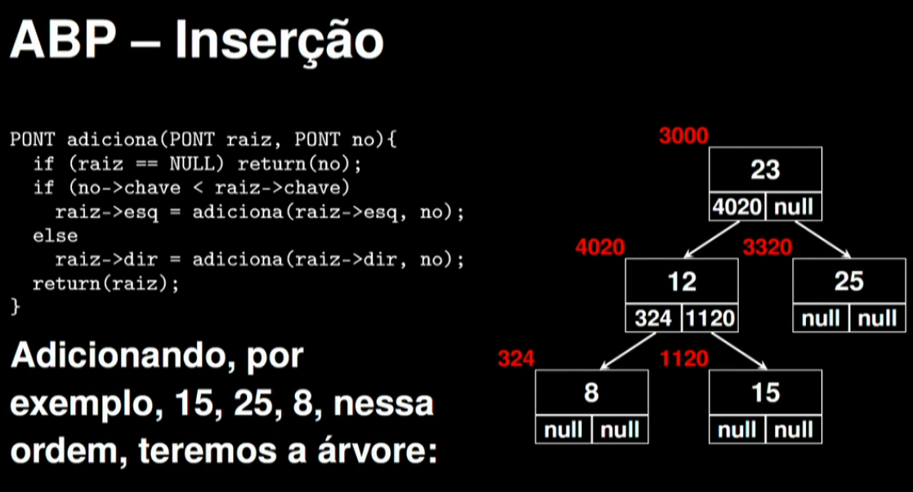
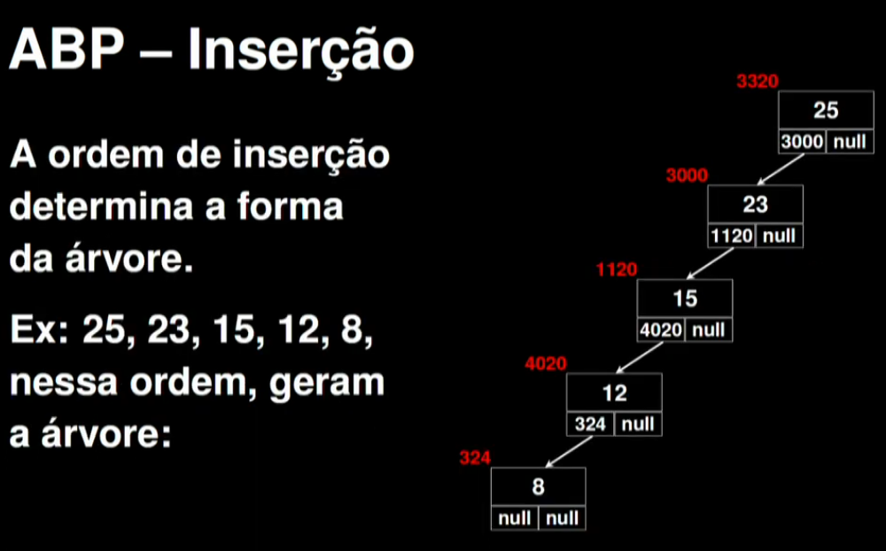
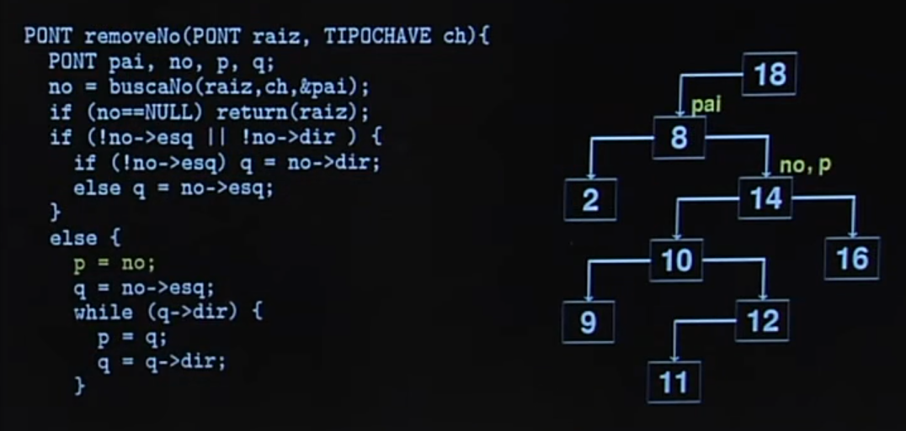
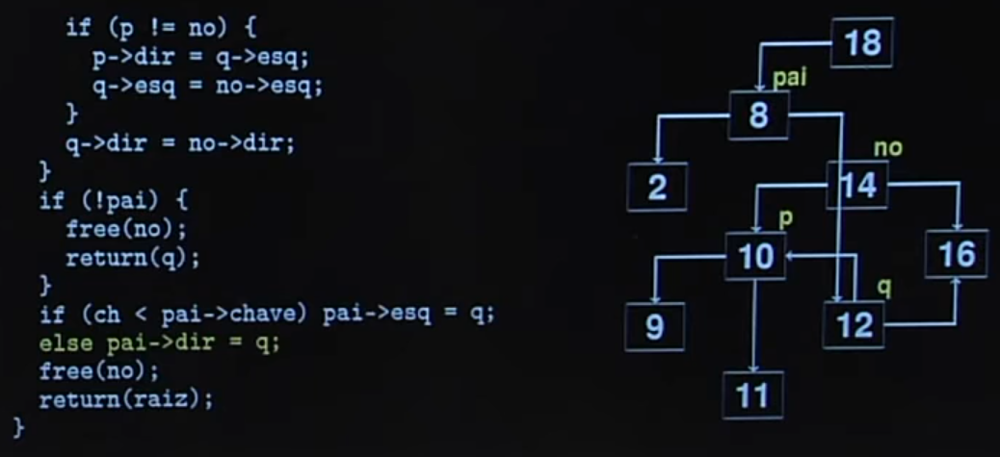
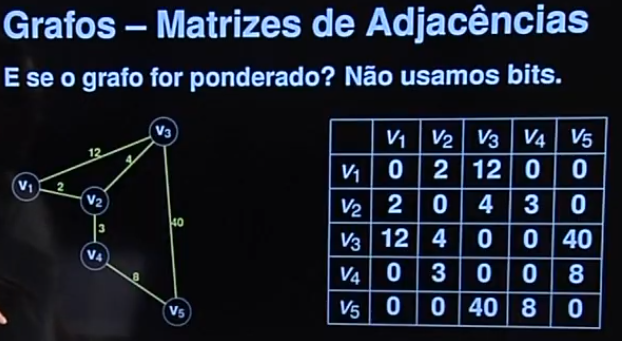
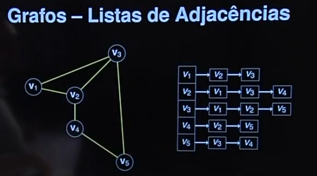

Notas e sequência das aulas de [estrutura de dados](https://www.youtube.com/playlist?list=PLxI8Can9yAHf8k8LrUePyj0y3lLpigGcl)

Funções de gerenciamento (para quase todas as estruturas de dados)

- Inicializar a estrutura
- Retornar a quantidade de elementos válidos
- Exibir os elementos da estrutura
- Buscar por um elemento na estrutura
- Inserir elementos na estrutura
- Excluir elementos na estrutura
- Reinicializar a estrutura

---

## Indice

01 - Apresentação da disciplina

- [file](test.c)

02 - Criação de uma primeira estrutura

- comparação entre Java e C
  - modelar, instanciar, acessar, uso de memoria
- ponteiro e alocação de memoria

- [file](./primeira-estrutura.c)
- [file](./ponteiros.c)
- [file](./alocacao-memoria.c)
- [file](./primeira-estrutura-com-alocacao-memoria.c)

03 - Lista linear sequencial
lista linear: estrutura de dados com cada elemento tendo anterior e sucessor (exceto 1o e ultimo); elementos possuem uma dada sequencia (inclusão, ordenados...)

lista linear sequencial: lista linear cuja ordem logica vista pelo usuário (4, 8, 9,1) é a mesma ordem física, em memória (ou seja, se excluir o 8, não ficará espaço em branco/inválido, os após são movidos para preencher essa lacuna, o mesmo deve ser feito no código)

modelagem:

- usa um arranjo de registros
- registros possuem dados relevantes ao usuário
- arranjo possui tamanho fixo

enquanto a primeira `cria uma cópia de uma lista` a segunda `faz referencia a lista definida` exibindo na img o endereço na memória na qual a lista esta sendo salva

- [file](./lista-linear-sequencial.c)

04 - Lista linear sequencial (continuação)

o que é visto?
- otimização da busca sequencial (busca com elemento sentinela)
- inserir elemento ordenado
- busca binaria

- [file](./lista-linear-continuacao.c)

05 - Lista ligada (implementação estática)

- [file](./lista-ligada.c)

06 - Lista ligada (implementação dinâmica)

Dinamico aqui significa qu pPara cada elemento que vai ser criado é alocado um espaço na memoria para armazena-lo (diferente de antes, onde o limite era estático) e quando se exclui a memoria é liberada.

- [file](./lista-ligada-dinamica.c)

07 - Lista ligada circular com nó cabeça

- [file](./lista-ligada-no-cabeca.c)

08 - Pilha (implementação estática)

Estrutura linear onde elementos a serem inseridos e excluidos sempre ficam no topo

- [file](./pilha-estatica.c)

09 - Pilha (implementação dinâmica)

Testei fazer diferente, após o prof falar o método, primeiro tentei implementar sem o vídeo. Consegui, pegar a lógica com mais facilidade pegando exemplo da [lista ligada dinâmica](./lista-ligada-dinamica.c) e adaptando para a pilha. O ultimo, depois de tentativas primeiro, consegui implementar com sucesso!!!

- [file](./pilha-dinamica.c)

10 - Deque

Espécie de fila com duas extremidades. Exemplos de uso:
- Histórico de navegador web
  - quando limite é atingido, a ponta antiga começa a 'deletar' registros e a ponta nova inclui os novos registros
- Agendamento de tarefas por prioridades
  - se for prioridade, vai pro inicio da fila, se não vai pro final
  - (pensei agr: no MC, checa se a pessoa é um diretor ou associado, se for é dado prioridade para essas pessoas, se não, vai pro fim da fila mesmo (só pensei, não acho que seja real))

- [file](./deque.c)

11 - Fila (imp. estática)

Assim como uma fila de mercado, banco... . Exemplos de casos de uso: 
- Saúde
- Alimentação
- Gov

- [file](./fila.c)

12 - Fila (imp. dinâmica)

- [file](./fila-dinamica.c)

13 - Pilha dupla

Feita para um problema mais específico, quando há um total fixo (30 alunos) mas precisam ser agrupados em sub grupos (aprovados e reprovados).

Feito assim para manter contexto e gerenciamento único. Cada topo cresce em direção a seu oposto.

Cenarios de caso de uso:
- Em um condomio, onde há numero total de casas, mas é preciso saber quais pagaram e quais não pagaram no mês recorrente.
- Em uma equipe, onde há um número total de integrantes, mas é preciso saber quais fizeram horas extras e quais não fizeram.

- [file](./pilha-dupla.c)

14 - Matriz esparsa

Utilizada quando maior parte elementos tem valor padrão, e só alguns tem valores diferentes. Portanto, por so alocar memoria para esses valores diferentes do padrão, torna a estrutura eficiente em gasto de memoria e processamento.

Possivel usar para representar grafos (aula mais adiante).

Casos de uso:
- Imagem em preto e branco
- PLN
- Machine Learning
- Sistema de recomendação

- [file](./matriz-esparsa.c)

15 - Arvores (conceito base)

- [file](./arvore-binaria.c)

16 - Arvore binária de pesquisa (parte 1)

Adiciona a implementação feita da árvore (15) a função de inicializar e de inserção.
- Foi definido que não haverá números repetidos.

A ordem de inserção define a forma da árvore. Vamos tratar adiante como isso vai ser trabalhado.

- [file](./arvore-binaria.c)

17 - Arvore binária de pesquisa (parte 2)

implementa
- buscar um elemento (sim, de maneira binaria tambem)
- contagem da quantidade de elementos
- leitura/impressão dos elementos da arvore

18 - Arvore binária de pesquisa (parte final)

implementa
- remoção de um nó

- [file](./arvore-binaria.c)

19 - Arvore N-ária

pode ter limite definido ou indefinido

- [file](./arvore-naria.c)

20 - Trie (tipo de arvore n-ária com limite)

casos de uso:
- autocompletar e sugestão de busca
- previsão de texto
compactação de dados
- bioinformática

- [file](./arvore-tries.c)

21 e 22 - Arvore AVL

é uma arvore de busca binária, com balanceamento, o que evita que se torne uma lista ligada (no pior dos cenarios).

o fator de balanceamento do nó é de +1, 0, -1. qualquer número diferente faz com que a função de balanceamento seja chamada

- [file](./arvore-avl.c)

23 - grafo: conceitos bases (papel)

24 - grafo: representações

algumas maneiras de representar computacionalmente, cada uma contendo seus trade-offs conforme o tamanho do grafo

implem. com uso de matrizes de adjacências

implem. com uso de listas de adjacências

- [file](./grafo.c)

25 - Operações básicas

Foi implementado:

1. Criação grafo sem aresta. 
2. Inclusão de aresta (adjacência) no grafo. 
3. Visualização do grafo. 

- [file](./grafo.c)

26 - Buscas em profundidade

- [file](./grafo-busca-profundidade.c)

27 - Buscas em largura (BFS)

Nos da a menor distância em número de aresta (relacionamento). Ou seja, se mudar o nó inicial, o resultado vai mudar tambem.

- [file](./grafo-busca-largura.c)

28 - Grafo com algoritmo de Dijkstra

O algoritmo BFS tem como ponto negativo, a depender do contexto, não levar em conta o peso das arestas/relações. Então em um cenário de GPS, por exemplo, onde preciso determinar o menor caminho do ponto A ao ponto B ele não é útil. Ai que entra esse algoritmo, ele vai varrendo todo o grafo e atualizando segundo o caminho mais curto.

Limitante: peso das arestas positivos.

A versão de `existirAberto` e `menorDistancia` não são a melhor implementação no quesito `velocidade`. (olhar `fila de prioridade`)

- [file](./grafo-algoritmo-dijkstra.c)

